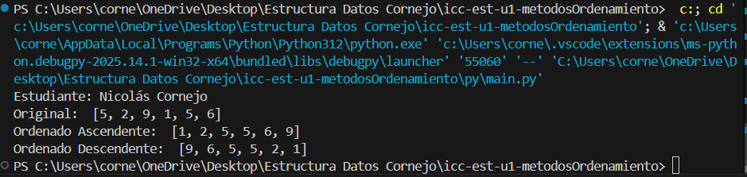
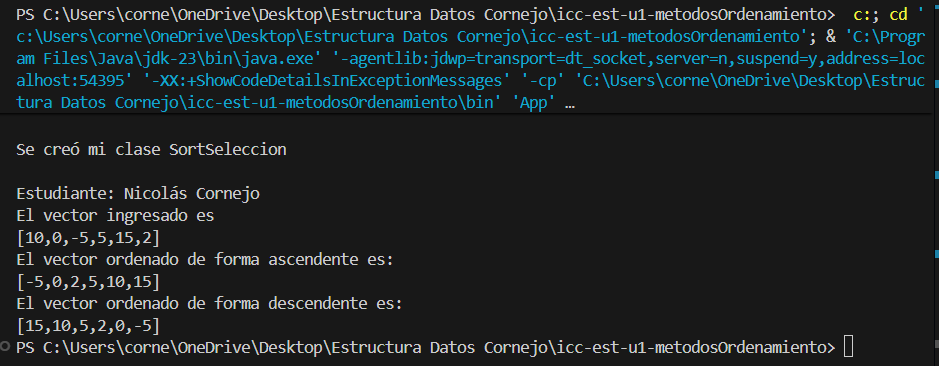
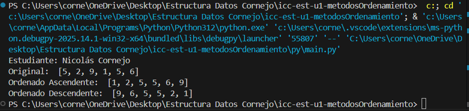
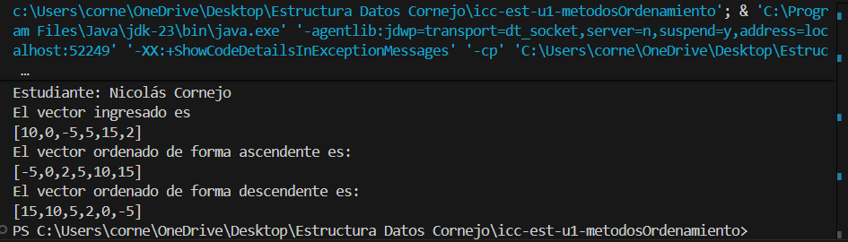
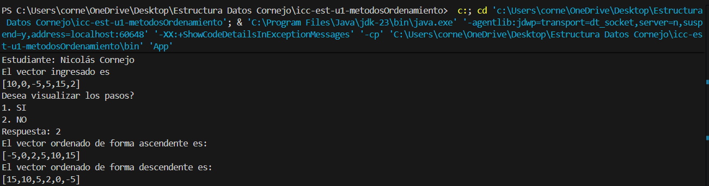
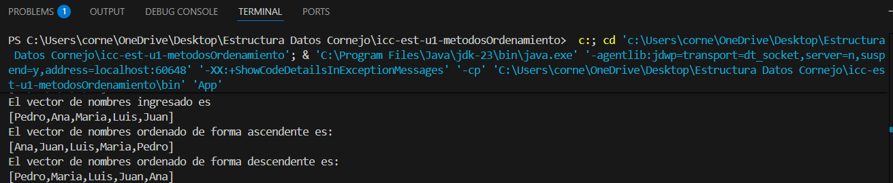
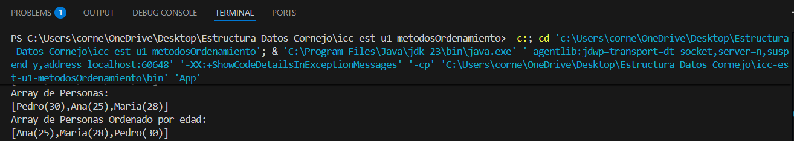
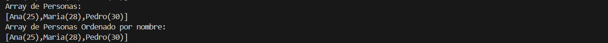

# Estructura de Datos

**Estudiante:** Nicolas Cornejo

## Metodos Ordenamiento

### Practica 1 - 20/OCT
Metodo Sort Bubble

### Practica 2 - 21/OCT
Metodo Sort Select en Java y Python

Salida de Python

Salida de Java

### Practica 3 - 23/OCT
Metodo Sort Insertion en Java y Python

Salida de Python

Salida de Java

Arreglo de Enteros, Cadenas y Arreglos

